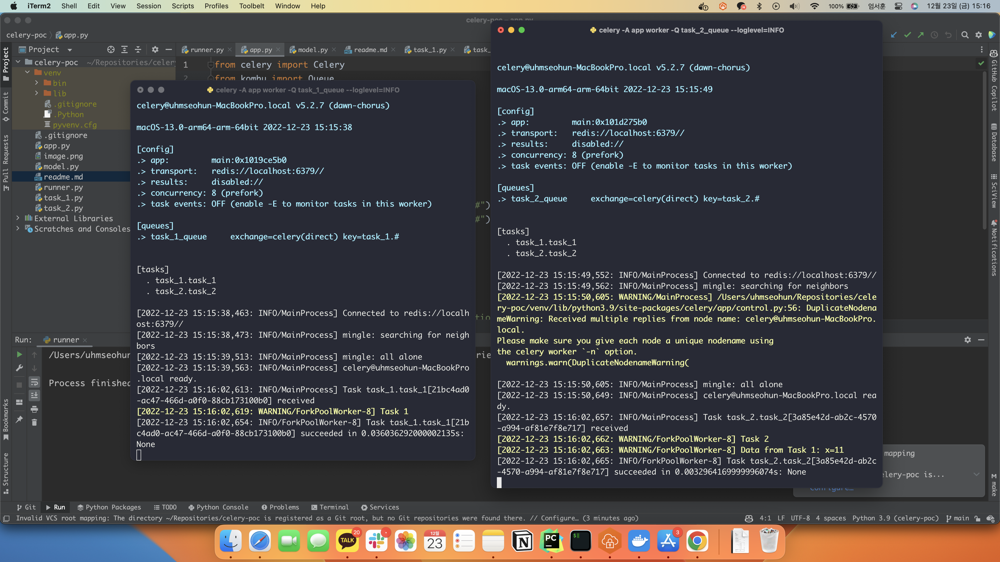

# Celery Pipeline POC

celery 기반 새로운 아키텍처 적용을 위한 celery pipeline poc



## overview
- pydantic 모델 지원 되는 것 확인.
- queue 별로 task 나누어서 보내는 것 확인.
- worker 에 따라서 각기 다른 queue 할당 하여 핸들러별로 나누어서 처리할 수 있음.

## command
```
celery -A app worker -Q task_1_queue --loglevel=info
celery -A app worker -Q task_2_queue --loglevel=info
```
